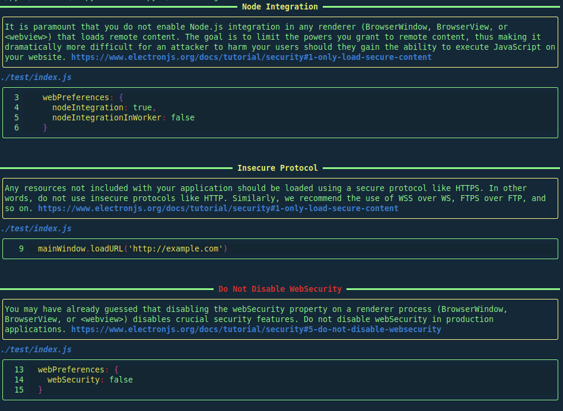

# Positron
## Electron Risk Detector
Electron JS is a framework which allows you to build cross-platform desktop apps with JavaScript, HTML, and CSS . However, those great powers come with greater responsibility. Running an application straight on an users desktop instead of just in a browser creates potential for some pretty ugly issues.

This applications strives to help developers working in Electron to avoid the most common and serious risks within the framework. It will not detect all issues, and like most static analysis tools it will have a high rate of false positives, but it is automatic and may lighten your load a bit

## Language Support:
The parser currently supports ECMAScript, and partly, JSX. It is unable to process a mix of JavaScript code and JSX. This is because switching to JSX mode requires an understanding of the context, which a tokenizer does not have. A closing JSX element (such as </Emoji>) confuses the tokenizer since the forward slash (/) is identified as the start of a regular expression.

## Development progress
As of now, the scanning looks for criteria specified in the official Electron documentation. The scanning is divided into two parts:

1. **Positive scanning**: Find patterns that should NOT occur, but do.
    This can be done line-by-line without storing
    any kind of context, since one occurence is
    enough to set off the alarm.
2. **Negative scanning**: Find patterns that SHOULD occur, but don't. When scanning like this, we need to keep the complete project in mind, since an absence of it in one file doesn't mean it's absent from the whole project.

Positive scanning is implemented. Negative scanning is not.

## How to use:
1. `python3 main.py <path-to-directory-of-electron-project>`

For verbose mode, where a brief explanation of the security risk is included, add the flag `-v`.

`python3 main.py <path-to-directory-of-electron-project> -v`

For a more plain mode with less terminal formatting, which may be more suitable for persistent logging, add the `-ng` flag when calling the program.

`python3 main.py <path-to-directory-of-electron-project> -ng`

## Screenshot
